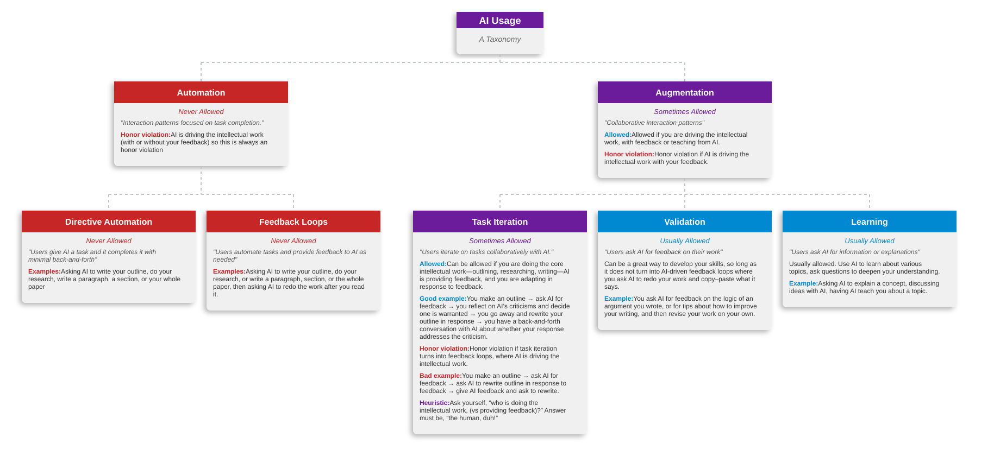
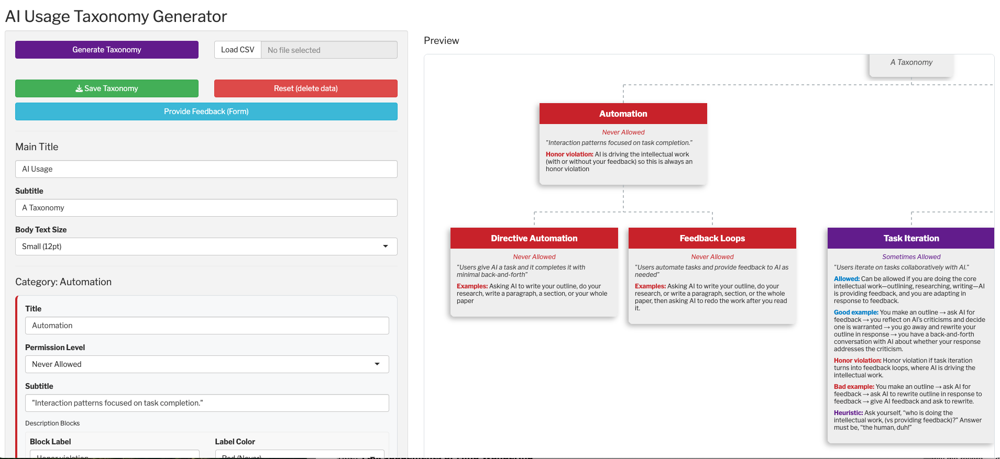

AITeachingTemplate's goal is to help professors design and communicate AI policies in their classroom. 
The idea is this: one barrier to effective AI policy is that professors and students don’t have a shared understanding of the different ways that we can use AI. 
In particular, our paradigm for AI usage is often restricted to automation: that is, offloading a task to AI (with or without feedback). 
But automation is usually inappropriate in educational contexts, where students are supposed to build critical thinking skills for themselves. 
So we’re stuck with banning AI or undermining education. But there are use cases for AI beyond automation, where AI provides us feedback on our critical thinking or helps us learn background skills and knowledge. 

One challenge is to develop a framework that we can use to communicate this difference to students in a way that’s accessible, sufficiently detailed, and ideally standardized. 
AITeachingTemplates is filling that gap. We start with a taxonomy of AI usage––distinguishing [automation from augmentation](https://www.anthropic.com/research/economic-index-primitives)––from Anthropic’s Economics research team. 
Professors would then use the app to select what uses of AI are allowed and disallowed in their classes and fill in details to explain the appropriate and inappropriate use-cases. 
The app outputs a diagram like the following, which you can include on a course website, syllabus, etc.:

The UI looks like this:

Professors use this UI to

1. Select which uses are allowed and disallowed
2. Add descriptions of the use cases (including optional examples)
3. Save their taxonomies as .svg files, which can be included on course websites
4. Save the data to generate the taxonomies as .csv files, and then load those csvs at at later date
